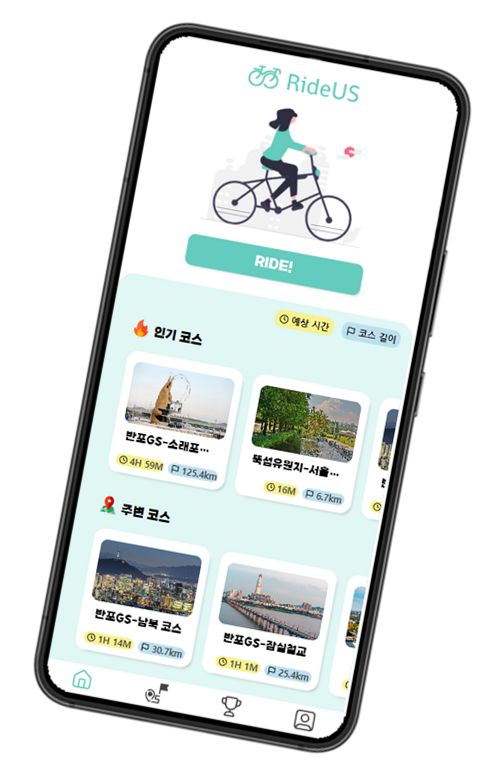

# 🚴‍♂️RideUS

취미 활동으로 무엇을 하고 계신가요?

최근 어느 통계 조사에 따르면 자전거를 통한 여행을 하고싶은 소비자가 약 33.3%로 생각보다 많은 수치입니다. 또한 연도별 따릉이 이용 통계를 보면 사용자가 꾸준히 늘고 있는 것을 알 수 있습니다.

네이버 검색 트렌드를 보면 2019년 12월 이후 폭발적으로 자전거 검색량이 늘어났지만, 점차 줄어드는 추세입니다. 이러한 문제의 원인을 자전거 서비스에서 찾을 수 있습니다.

자전거 관련 서비스는 많지만 단순히 자전거 속도계, 네비게이션의 역할만 할 뿐입니다. 자유로움과 동시에 사람과의 소통을 통해 자랑하고 공유하는 걸 좋아하는 2030에게는 아쉬운 서비스입니다.

이러한 단점을 보완하기 위해 새로운 기능들을 추가한 신개념 자전거 주행 플랫폼 RideUs를 개발했습니다.

# 대표 기능

### 나만의 코스

자유롭게 자전거 주행 후, 주행한 코스 기록을 다른 사용자들에게 공유할 수 있는 기능

### 그룹 주행

같이 주행하고 싶은 사용자들을 초대하여 함께 주행하는 기능

함께 주행하는 사용자들의 위치를 실시간으로 공유

주행 후, 그룹 리포트를 통해 사용자들의 기록 확인

주행 후, 해당 코스에 대한 리뷰 작성 가능

### 추천 코스 조회 및 주변 정보 조회

RideUs만의 알고리즘을 통해 코스들을 추천

코스 주변의 음식점, 화장실, 편의점, 자전거 수리점 등 7가지 종류의 주변 정보를 확인할 수 있음

# 아키텍쳐 설계도

## 배포

### AWS EC2

AWS EC2를 활용하여 클라우드 환경에서 배포

언제, 어디서든지 접근하여 사용할 수 있고 관리할 수 있는 환경 구축

### Dokcer

컨테이너 기술을 활용한 Docker를 사용하여 애플리케이션을 신속하고 편리하게 배포할 수 있게 구축

### CI/CD

GitLab과 Jenkins를 연결하여 소스 코드 작성 후, GitLab에 Push하면 Webhook을 통해 Jenkins에 알려주고 자동으로 Build 및 배포할 수 있게 CI/CD 환경을 구축

## 데이터베이스

### MySQL

서비스의 비즈니스 로직에 필요한 데이터들을 저장 및 관리

### MongoDB

자전거 주행 후 수집되는 좌표 데이터 리스트들을 저장 및 관리

### Redis

자전거 주행 기록의 랭킹 데이터를 캐싱하여 Redis에 저장

랭킹 데이터를 조회할 때마다 DB에 쿼리를 발생시키면 DB에 부하가 있고, 조회 속도가 느려질 것이라고 판단하여 캐싱 DB인 Redis에 저장하여 빠르게 조회해 옴

일주일 단위로 랭킹 갱신하여 보여줌

### AWS S3

코스 이미지, 리뷰 이미지, 프로필 이미지 등 이미지 파일을 클라우드 환경인 AWS S3에 저장하고 관리

언제 어디서든 이미지에 접근할 수 있게 설정

# 주요 기능 구현

### 그룹 주행

1. 그룹 주행을 시작하면 그룹방 데이터를 생성
2. 해당 그룹방 식별자를 담은 URL로 웹소켓 생성 및 연결
3. 이 URL을 공유받고 클릭한 참가자들을 웹소켓으로 연결
4. 실시간으로 자신의 위치 좌표 데이터를 웹소켓으로 전달하여 사용자들에게 공유

### 코스 추천 알고리즘

1. 코스를 선택하여 자전거 주행을 한 후, 리뷰 작성을 할 때 해당 코스에 대한 태그 선택 가능(ex. #평지, #한적함, #쾌적함, #라이더 많음, #공원 근처, #자전거 도로 등 총 16개의 태그)
2. 본인이 등록한 태그 데이터를 바탕으로 본인이 등록한 태그들 중 가장 많이 단 태그 순으로 상위 5개를 추출하여 저장
3. 코스 리뷰에 달린 태그들을 바탕으로 코스에 달린 태그들 중 가장 많이 달린 태그 순으로 상위 5개를 추출하여 저장
4. 2번, 3번에서 저장한 데이터를 비교하여 사용자 본인의 상위 5개 태그와 코스의 상위 5개 태그가 일치하는 것이 많은 순으로 코스를 추천
